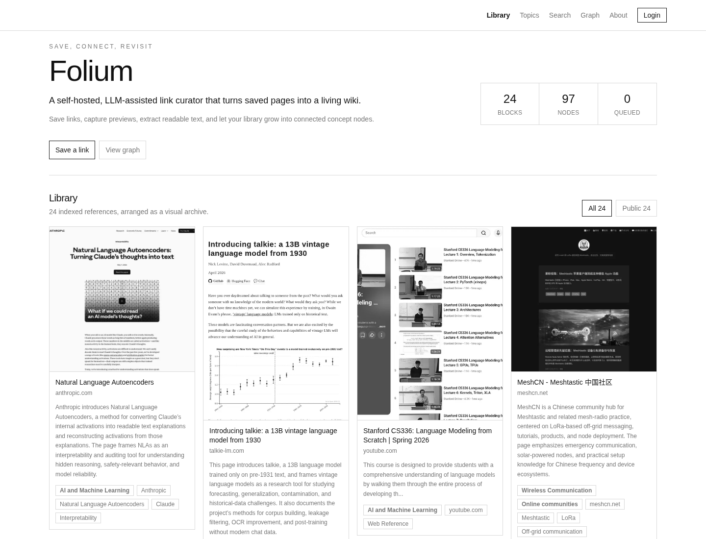
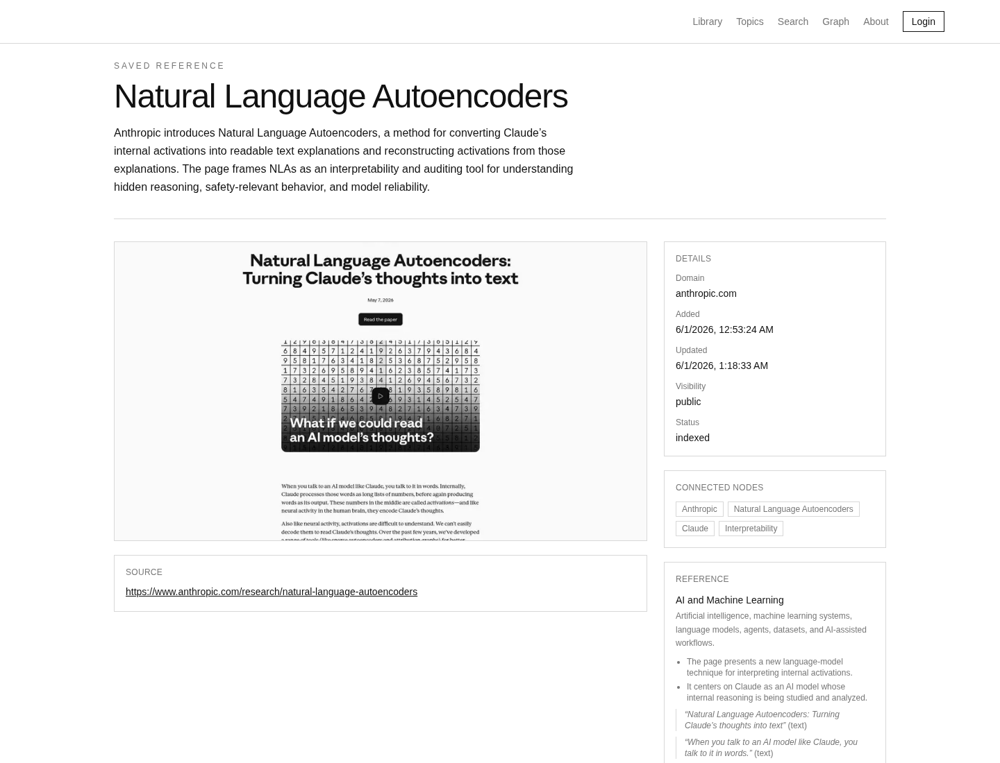
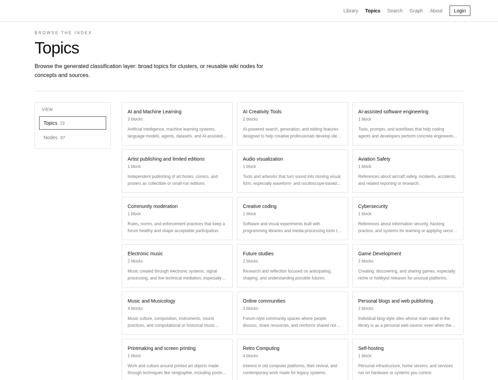
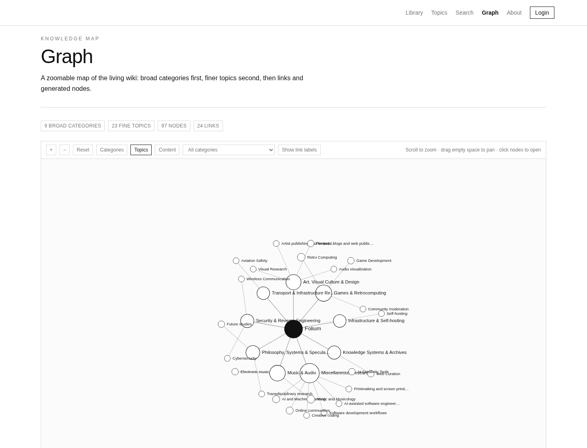
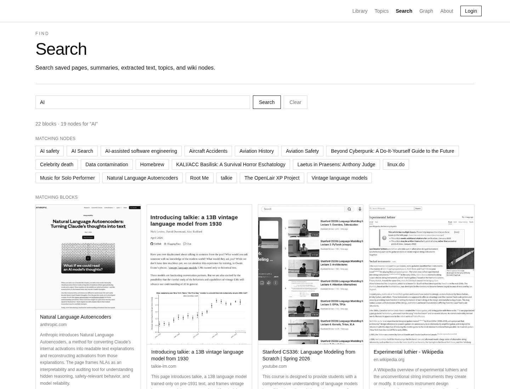

# Folium

[简体中文](./README.zh-CN.md)

A self-hosted LLM wiki and curated link library for the web you keep.

Folium saves links, extracts readable text, captures visual previews, summarizes pages, and organizes them into broad topics and reusable wiki nodes. Browse your library as cards, search results, topic pages, or a graph.

Demo: https://folium.fyi/

> Status: under active development. Folium is currently a single-user self-hosted app, not a production-hardened public multi-user service.

## Screenshots

### Library



### Block detail



### Topics and nodes



### Graph



### Search



## Features

- Save URLs as private-by-default blocks, with optional public visibility.
- Extract readable text, metadata, favicons, and screenshots in a background worker.
- Analyze pages with an OpenAI-compatible LLM into summaries, broad topics, wiki nodes, claims, and references.
- Browse by visual library, topics/nodes, search, graph, and block detail pages.
- Use protected screenshot routes so private previews are not served as public static files.
- Detect verification/login-blocked pages and add manual or browser-provided content instead.
- Use the Folium Web Clipper for Chrome/Chromium and Firefox to save pages from your own browser session.
- Use the HTTP API, in-repo CLI, and experimental MCP server for agent workflows.
- Manage named Agent API tokens, backups, AI settings, visibility, pinning, retries, and reprocessing from the UI.

## Quick start

```bash
npm install
cp .env.example .env.local
npm run dev:all
```

Open `http://localhost:3000`.

Useful pages:

- `/` — library
- `/topics` — topics and nodes
- `/search` — search
- `/graph` — graph
- `/processing` — worker queue, authenticated only
- `/settings` — account, AI settings, API tokens, backups

## Production

```bash
npm install
npm run build
npm run start:all -- -H 0.0.0.0 -p 3000
```

For systemd or another process manager, run web and worker separately:

```bash
npm run start
npm run worker
```

Docker Compose:

```bash
cp .env.example .env.local
docker compose up --build
```

## Configuration

Set these before exposing Folium beyond localhost:

- `FOLIUM_USERNAME`
- `FOLIUM_PASSWORD`
- `FOLIUM_SESSION_SECRET`

Set `OPENAI_API_KEY` to enable LLM analysis. You can use any OpenAI-compatible chat-completions endpoint with `OPENAI_BASE_URL` and `OPENAI_MODEL`.

If Playwright has no Chromium installed:

```bash
npx playwright install chromium
```

## CLI, API, and Web Clipper

- CLI docs: [docs/cli.md](./docs/cli.md)
- Web Clipper docs: [docs/extension.md](./docs/extension.md)
- Agent skill: [skills/folium/SKILL.md](./skills/folium/SKILL.md)

Generate Agent API tokens in Settings. Use them for the CLI, Web Clipper, HTTP API, and MCP workflows.

## Data and security notes

- Runtime data lives under `data/`; do not commit it.
- New links are private by default; guests only see public content.
- Auth is single-user username/password.
- Passwords use Node `scrypt`; older SHA-256 hashes are upgraded after login.
- Mutating forms use CSRF protection.
- URL ingestion rejects localhost, private, link-local, and reserved IP ranges.
- Run behind HTTPS if exposed publicly.
- Back up `data/` or use Settings → Backup / restore before upgrades.

## Limitations

- JSON storage is used for the current prototype; SQLite/Postgres is planned.
- Taxonomy quality depends on the configured LLM and is still being tuned.
- Some sites block extraction or screenshot capture; use manual fallback or the Web Clipper.
- The taxonomy admin UI exists but is not exposed in the main navigation yet.
- Bulk import/export, richer document extraction, and semantic search are still on the roadmap.

## Roadmap

Near term:

- [ ] Improve worker diagnostics and processing event history.
- [ ] Add API route and CLI command tests.
- [ ] Package the CLI for easier local/global install.
- [ ] Add production Docker health checks and systemd/Caddy/nginx examples.
- [ ] Add Library list view, density controls, and bulk actions.
- [ ] Finish taxonomy rename/alias/merge/delete review flows.
- [ ] Add import/export for bookmarks, JSON, Markdown, Linkding, and Raindrop.

Search and storage:

- [ ] Move from JSON storage to SQLite or Postgres.
- [ ] Add full-text indexes.
- [ ] Add embeddings and semantic search.
- [ ] Improve graph edge extraction and low-signal node hiding.

Content support:

- [ ] PDF extraction.
- [ ] Image upload and OCR.
- [ ] YouTube transcript support.
- [ ] Optional local-first readable HTML/text archiving.

Longer term:

- [ ] Read-only demo mode for public deployments.
- [ ] Optional token scopes and API rate limiting.
- [ ] Documented MCP client configuration examples.
- [ ] Optional multi-user or team model after the single-user experience is stable.

## License

Apache-2.0. See [LICENSE](./LICENSE).
