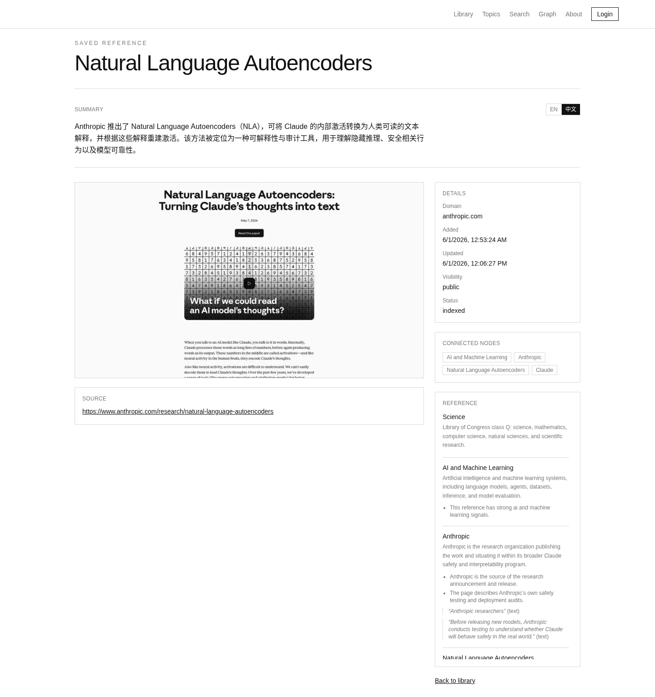
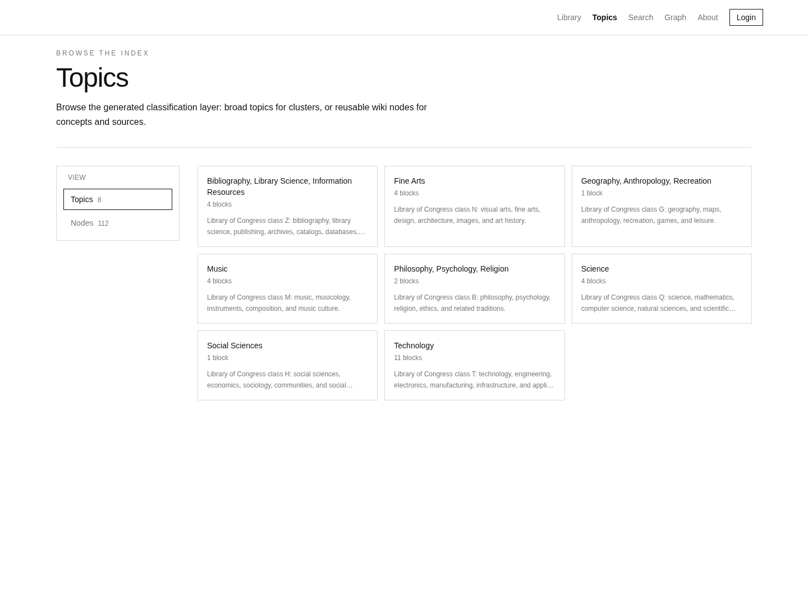
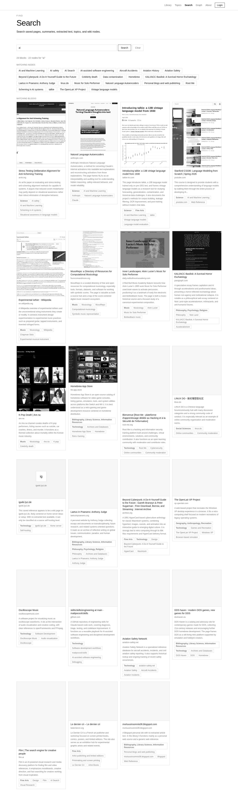

# Folium

[English](./README.md)

一个自托管的 LLM Wiki 与策展式链接库，用来收藏你想保留的网络内容。

Folium 会保存链接、抽取可读正文、捕获视觉预览、总结页面，并把内容整理成宽泛主题和可复用的 Wiki 节点。你可以用卡片、搜索、主题页或图谱浏览自己的资料库。

演示站点：https://folium.fyi/

> 状态：正在积极开发中。Folium 目前是单用户自托管应用，不是已经生产加固的公开多用户服务。

## 截图

### Library


### Block 详情



### Topics 与 Nodes



### Graph


### Search



## 功能

- 将 URL 保存为默认私有的 blocks，也可以设为公开。
- 后台 worker 抽取正文、元数据、favicon 和截图。
- 通过 OpenAI-compatible LLM 生成摘要、宽泛主题、Wiki 节点、claims 和 references。
- 支持 Library、Topics/Nodes、Search、Graph 和 Block detail 浏览。
- 私有截图通过受保护路由访问，不作为公开静态文件暴露。
- 检测验证页 / 登录墙，并支持手动内容或浏览器提供的内容。
- 使用 Folium Web Clipper 在 Chrome/Chromium 和 Firefox 中从自己的浏览器会话保存页面。
- 使用 HTTP API、repo 内 CLI 和实验性 MCP server 接入 agent 工作流。
- 在 UI 中管理命名 Agent API tokens、备份、AI 设置、可见性、pin、重试与重新处理。

## 快速开始

```bash
npm install
cp .env.example .env.local
npm run dev:all
```

打开 `http://localhost:3000`。

常用页面：

- `/` — Library
- `/topics` — Topics 与 Nodes
- `/search` — 搜索
- `/graph` — 图谱
- `/processing` — worker 队列，仅登录可见
- `/settings` — 账号、AI 设置、API tokens、备份

## 生产运行

```bash
npm install
npm run build
npm run start:all -- -H 0.0.0.0 -p 3000
```

如果使用 systemd 或其他进程管理器，请分开运行 web 和 worker：

```bash
npm run start
npm run worker
```

Docker Compose：

```bash
cp .env.example .env.local
docker compose up --build
```

## 配置

暴露到 localhost 以外之前，请设置：

- `FOLIUM_USERNAME`
- `FOLIUM_PASSWORD`
- `FOLIUM_SESSION_SECRET`

设置 `OPENAI_API_KEY` 可启用 LLM 分析。也可以通过 `OPENAI_BASE_URL` 和 `OPENAI_MODEL` 使用任何 OpenAI-compatible chat-completions endpoint。

如果 Playwright 没有安装 Chromium：

```bash
npx playwright install chromium
```

## CLI、API 与 Web Clipper

- CLI 文档：[docs/cli.md](./docs/cli.md)
- Web Clipper 文档：[docs/extension.md](./docs/extension.md)
- Agent skill：[skills/folium/SKILL.md](./skills/folium/SKILL.md)

在 Settings 中生成 Agent API token。CLI、Web Clipper、HTTP API 和 MCP 工作流都使用这些 token。

## 数据与安全说明

- 运行时数据位于 `data/`，不要提交它。
- 新链接默认私有；游客只能看到公开内容。
- 认证是单用户用户名/密码模式。
- 密码使用 Node `scrypt`；旧 SHA-256 hash 会在登录后升级。
- 表单变更使用 CSRF 保护。
- URL ingestion 会拒绝 localhost、私有、link-local 和 reserved IP 范围。
- 如果公开访问，请放在 HTTPS 后面。
- 升级前请备份 `data/`，或使用 Settings → Backup / restore。

## 当前限制

- 当前原型使用 JSON 存储；后续计划迁移到 SQLite/Postgres。
- 分类使用 LCC canonical topics 与 deterministic node hints，但策展和审核控制仍在调优。
- 部分网站会阻止抽取或截图；可以使用手动 fallback 或 Web Clipper。
- 分类管理 UI 已存在，但尚未放到主导航。
- 批量导入/导出、更丰富的文档抽取和语义搜索仍在路线图中。

## Roadmap

已完成基础能力：

- [x] 为 blocks、search、status、extraction、visibility 和 pinning 添加认证 HTTP API。
- [x] 在 `packages/cli` 下添加 repo 内 CLI，支持 save/search/get/extract/curation 工作流。
- [x] 添加 CLI docs、agent skill 和项目级 `AGENTS.md`。
- [x] 添加实验性 stdio MCP server。
- [x] 添加 Chrome/Chromium 与 Firefox Folium Web Clipper。
- [x] 添加命名 Agent API tokens，包含 created-at、last-used-at 和 revoke 控制。
- [x] 默认私有保存，并在 library、search、topics、graph、screenshots 和 API 输出中实现 public/private 过滤。
- [x] 添加受保护截图、WebP 缩略图、lazy loading 和稳定 library grid 排序。
- [x] 添加重复 URL 检测、canonicalization 和重复保存回到首页前排。
- [x] 添加 atomic JSON writes、file locking、stale job recovery、retry metadata 和 worker heartbeat。
- [x] 添加更强密码哈希、登录限流、CSRF 保护和 SSRF URL 检查。
- [x] 添加 Backup/restore UI。
- [x] 为 blocked/login-gated 页面添加手动内容 fallback 和浏览器提供内容的 clipping。
- [x] 添加 Topics/Nodes 浏览页、独立 Search 页、Graph 视图、pinning 和 processing controls。
- [x] 添加 LCC canonical topic registry、deterministic domain nodes，并在卡片上显示 topic/node tags。
- [x] 添加中英文双语 summaries，并通过 Settings 控制 summary language toggle。
- [x] 改进 Graph 可读性：LCC topic islands、隐藏 source、relevance filtering、hover focus 和 orphan-node filtering。

近期：

- [ ] 添加 block-level 手动 topic/node 编辑和 override controls。
- [ ] 改进 worker diagnostics 与 processing event history。
- [ ] 添加 taxonomy suggestions review queue，审核后再影响全局图谱。
- [ ] 记录 deterministic taxonomy explanations：命中的 LCC rule、terms、source 和添加的 node hints。
- [ ] 先添加 JSON 与浏览器 bookmarks 导入/导出，再支持 Markdown、Linkding 和 Raindrop。
- [ ] 添加 API route 和 CLI command 测试。
- [ ] 打包 CLI，方便本地/全局安装。
- [ ] 添加生产 Docker health checks 和 systemd/Caddy/nginx 示例。
- [ ] 添加 Library list view、密度控制和批量操作。

Taxonomy 与策展质量：

- [x] 将 canonical taxonomy 和 deterministic LCC rules 移到独立 taxonomy module。
- [ ] 将 taxonomy explanation、review 和 override flows 拆到独立模块。
- [ ] 添加 negative/context rules，减少误判 nodes 和 topic hints。
- [ ] 完成 taxonomy rename、alias、merge、delete 和 canonical review flows。
- [ ] 添加 derived topic-node visual edges 和更强的 low-signal node pruning。

搜索与存储：

- [ ] 从 JSON 存储迁移到 SQLite 或 Postgres。
- [ ] 添加全文索引。
- [ ] 添加 embeddings 与语义搜索。
- [ ] 添加更丰富的 graph edge extraction，不只依赖 block-topic 和 block-node links。

内容支持：

- [ ] PDF 抽取。
- [ ] 图片上传与 OCR。
- [ ] YouTube transcript 支持。
- [ ] 可选 local-first readable HTML/text 归档。

长期：

- [ ] 为公开部署添加 read-only demo mode。
- [ ] 添加可选 token scopes 和 API rate limiting。
- [ ] 添加 MCP client configuration 示例文档。
- [ ] 单用户体验稳定后，再考虑可选多用户或团队模式。

## License

Apache-2.0。详情见 [LICENSE](./LICENSE)。
